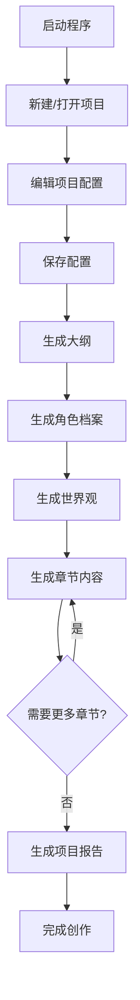

# 🖥️ AI小说创作助手 - GUI使用指南

## 📋 目录
- [快速开始](#快速开始)
- [界面介绍](#界面介绍)
- [功能详解](#功能详解)
- [使用流程](#使用流程)
- [常见问题](#常见问题)
- [技巧提示](#技巧提示)

## 🚀 快速开始

### 1. 启动程序

**方法一：双击启动**
- 直接双击 `run_gui.py` 文件

**方法二：命令行启动**
```bash
python run_gui.py
```

### 2. 首次使用检查

程序启动时会自动检查：
- ✅ 依赖包是否安装完整
- ✅ API密钥文件是否存在
- ✅ 核心模块是否正常

如有问题，程序会显示相应的错误提示和解决方案。

## 🖼️ 界面介绍

### 主界面布局

```
┌─────────────────────────────────────────────────────────┐
│                🖋️ AI小说创作助手                        │
├──────────────┬──────────────────────────────────────────┤
│              │  ⚙️ 项目配置  │  📖 生成内容  │  📝 操作日志  │
│   📋 控制面板  │                                        │
│              │                                        │
│  📁 项目管理   │            内容显示区域                  │
│  ⚙️ 配置编辑   │                                        │
│  🎯 内容生成   │                                        │
│  🔄 批量操作   │                                        │
│  🛠️ 工具      │                                        │
├──────────────┴──────────────────────────────────────────┤
│  状态栏: 准备就绪                          进度条: ████  │
└─────────────────────────────────────────────────────────┘
```

### 控制面板功能

#### 📁 项目管理
- **🆕 新建项目**: 创建新的小说项目
- **📂 打开项目**: 加载现有项目
- **💾 保存项目**: 保存当前项目

#### ⚙️ 配置编辑
- **📝 编辑配置**: 切换到配置编辑页面
- **🔄 重新加载**: 重新加载项目配置

#### 🎯 内容生成
- **📋 生成大纲**: 根据配置生成小说大纲
- **👤 生成角色档案**: 创建详细的角色设定
- **🌍 生成世界观**: 构建故事世界设定
- **📖 生成章节**: 生成具体章节内容

#### 🔄 批量操作
- **🚀 批量生成章节**: 一次性生成多个章节
- **📊 生成项目报告**: 统计项目进度和信息

#### 🛠️ 工具
- **📁 打开项目文件夹**: 在文件管理器中打开项目目录
- **❓ 帮助**: 显示详细的使用帮助

## 🔧 功能详解

### 1. 项目管理

#### 新建项目
1. 点击 **🆕 新建项目**
2. 输入项目名称
3. 程序自动创建项目文件夹和配置文件
4. 自动加载项目到界面

#### 打开项目
1. 点击 **📂 打开项目**
2. 选择包含 `novel_ideas.json` 的项目文件夹
3. 程序自动加载项目配置

### 2. 配置编辑

在 **⚙️ 项目配置** 标签页中，您可以编辑：

#### 📚 小说基本信息
- **小说标题**: 您的小说名称
- **小说类型**: 从下拉菜单选择类型（科幻、奇幻、言情等）
- **目标章节数**: 计划创作的章节总数

#### 💡 故事创意
- **核心创意**: 描述您的核心故事想法
- **主题思想**: 小说要表达的主题

#### 👤 主要角色
- **主角姓名**: 主人公的名字
- **主角背景**: 主人公的详细背景设定

**💾 记得点击"保存配置"按钮保存更改！**

### 3. 内容生成

#### 生成大纲
1. 确保项目配置已完善
2. 点击 **📋 生成大纲**
3. 等待AI生成完整的小说大纲
4. 结果显示在"生成内容"标签页
5. 自动保存到项目文件夹

#### 生成章节
1. 点击 **📖 生成章节**
2. 在弹出对话框中填写：
   - 章节编号
   - 章节大纲（简要描述本章内容）
   - 目标字数
3. 点击"生成"开始创作
4. 生成的章节保存在 `chapters/` 文件夹

#### 批量生成章节
1. 点击 **🚀 批量生成章节**
2. 设置起始和结束章节编号
3. 确认生成（注意API调用次数）
4. 程序自动依次生成各章节

### 4. 内容管理

在 **📖 生成内容** 标签页中：
- **📋 复制内容**: 复制到剪贴板
- **💾 保存到文件**: 导出为文本文件
- **🗑️ 清空内容**: 清空显示区域

### 5. 操作日志

**📝 操作日志** 标签页记录所有操作：
- 项目创建/加载
- 内容生成过程
- 错误信息
- 文件保存位置

## 📝 使用流程

### 完整创作流程



### 推荐步骤

1. **📋 准备阶段**
   - 新建项目
   - 填写基本信息和创意
   - 保存配置

2. **🎯 设定阶段**
   - 生成小说大纲
   - 生成角色档案
   - 生成世界观设定

3. **✍️ 创作阶段**
   - 逐章生成内容
   - 或使用批量生成
   - 根据需要调整和完善

4. **📊 完成阶段**
   - 生成项目报告
   - 整理和导出内容

## ❓ 常见问题

### Q: 程序启动失败怎么办？
**A:** 检查以下几点：
1. 确保安装了所有依赖：`pip install -r requirements.txt`
2. 确保Python版本 >= 3.7
3. 检查 `apikey.md` 文件是否存在
4. 运行 `python test_gui.py` 进行诊断

### Q: API调用失败怎么办？
**A:** 可能的原因：
1. API密钥无效或过期
2. 网络连接问题
3. API配额不足
4. 请求频率过高

### Q: 生成的内容质量不满意？
**A:** 改进建议：
1. 完善项目配置，提供更详细的背景信息
2. 在章节大纲中给出更具体的指导
3. 调整目标字数
4. 多次生成并选择最佳结果

### Q: 如何备份项目？
**A:** 项目文件都保存在 `projects/项目名称/` 文件夹中，直接复制整个文件夹即可备份。

## 💡 技巧提示

### 配置技巧
- **详细描述**: 在核心创意中提供越详细的描述，生成的内容质量越高
- **明确风格**: 在配置中明确指定写作风格和目标读者
- **角色设定**: 提供丰富的角色背景，有助于生成更生动的对话和情节

### 生成技巧
- **分步进行**: 先生成大纲，再生成角色，最后生成章节
- **章节大纲**: 为每章提供3-5句话的大纲，指导内容生成方向
- **适量字数**: 建议每章2000-3000字，既保证质量又控制成本

### 管理技巧
- **定期保存**: 及时保存重要内容，避免意外丢失
- **版本管理**: 为重要版本创建备份
- **日志查看**: 通过操作日志追踪问题和进度

### 效率技巧
- **批量生成**: 对于结构化内容，使用批量生成功能
- **模板复用**: 保存好的配置作为模板，用于类似项目
- **快捷操作**: 熟悉键盘快捷键，提高操作效率

## 🎉 开始创作

现在您已经了解了GUI版本的所有功能，可以开始您的AI小说创作之旅了！

记住：
- 💡 **创意是核心** - 提供详细的想法和设定
- 🎯 **循序渐进** - 按步骤完成各个环节
- 🔄 **迭代完善** - 根据结果调整和优化
- 📝 **记录过程** - 利用日志功能跟踪进度

祝您创作愉快！🖋️✨